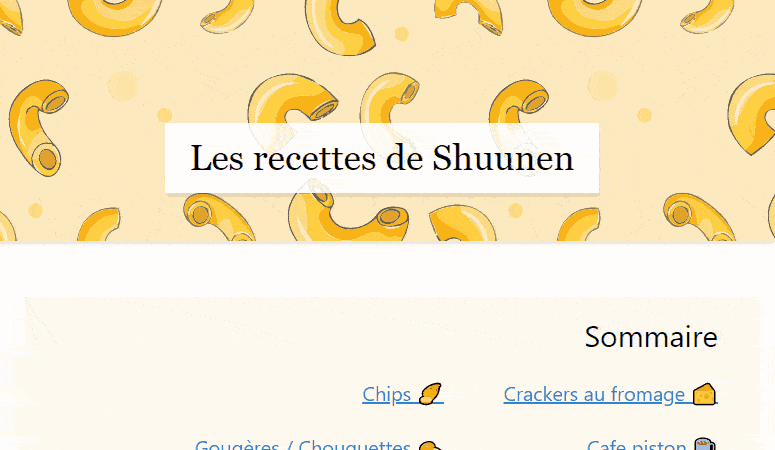

# Recipes

> My personal [ french ] recipes

## Demo

## Todo

- [ ] mettre en place un lint pour formaliser les recettes de manière uniforme

## Thanks

- [Boxy Svg](https://boxy-svg.com) : simple & effective svg editor
- [Github](https://github.com) : this great, free and evolving platform
- [Gordon Johnson](https://pixabay.com/users/GDJ-1086657) : elegant divider
- [Netlify](https://netlify.com/) : always here offering free hosting for open source projects
- [Shields.io](https://shields.io) : for the nice badges on top of this readme
- [SvgOmg](https://jakearchibald.github.io/svgomg/) : the great king of svg file size reduction
- [Vecteezy](https://www.vecteezy.com/free-vector/macaroni) : funky macaroni pattern background (I made it repeatable)
