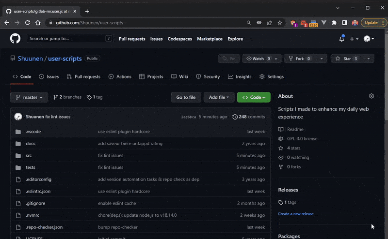
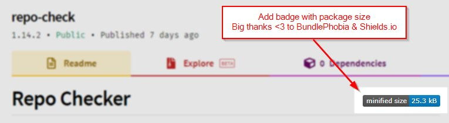
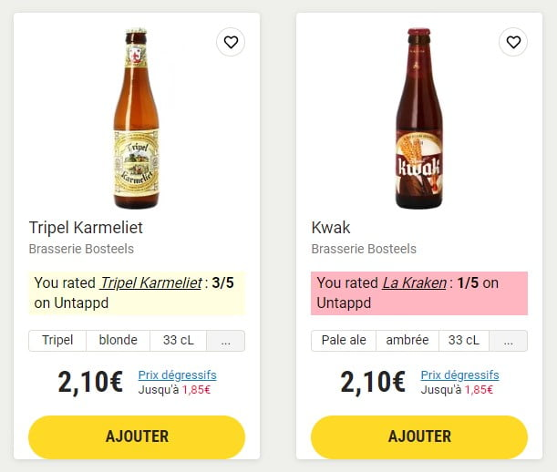

# User Scripts

> Personal heavily opinionated script I make to enhance my daily web experience.

## Usage

1. Make sure you have [ViolentMonkey](https://violentmonkey.github.io) installed
2. Open the script you want to use (use raw view)
3. Review the code, no one should trust a random script from the internet
4. Install the script in your browser

## Scripts

### Amazon - Clearer

### Amazon - Hide products by keywords

### BundlePhobia <3 Everywhere

Works on Github & Npmjs.org for now.

### Saveur Bière - Untappd Ratings

Fetch your own beer ratings from Untappd and inject them in the search results to facilitate orders.

## Prompt to follow guidelines

Acknowledge the guidelines for user scripts inside `.github/copilot-instructions.md` then fix all issues listed by `nx lint user-scripts` command.

At the end run `nx typecheck user-scripts` and `nx test user-scripts` to make sure you have not break anything.

Don't provide me any explanations/comments/summary, just iterate, fix all the issues and run the commands at the end.

## Todo

- [ ] fix disabled lint rules

## Thanks

- [Boxy Svg](https://boxy-svg.com) : simple & effective svg editor
- [Eslint](https://eslint.org) : super tool to find & fix problems
- [Github](https://github.com) : for all their great work year after year, pushing OSS forward
- [Knip](https://github.com/webpro/knip) : super tool to find & fix problems
- [Oxc](https://oxc.rs) : a lovely super-fast collection of JavaScript tools written in Rust
- [Repo-checker](https://github.com/Shuunen/repo-checker) : eslint cover /src code and this tool the rest ^^
- [Shields.io](https://shields.io) : for the nice badges on top of this readme
- [Svg Omg](https://jakearchibald.github.io/svgomg/) : the great king of svg file size reduction
- [TailwindCss](https://tailwindcss.com) : awesome lib to produce maintainable style
- [Vitest](https://github.com/vitest-dev/vitest) : super fast vite-native testing framework

## Page views

