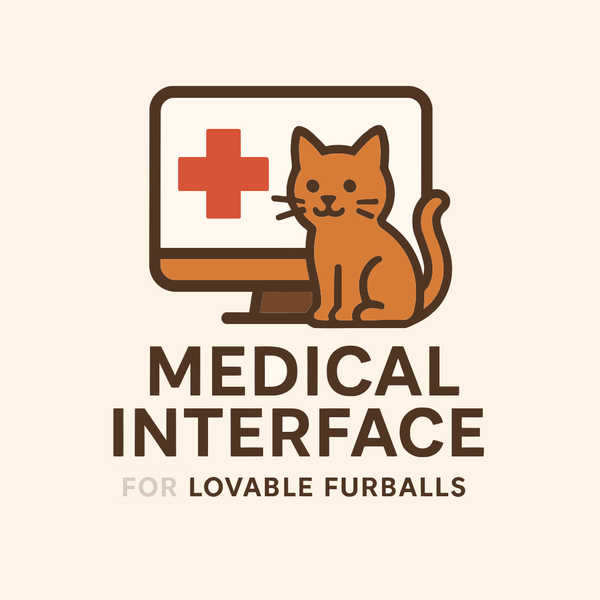
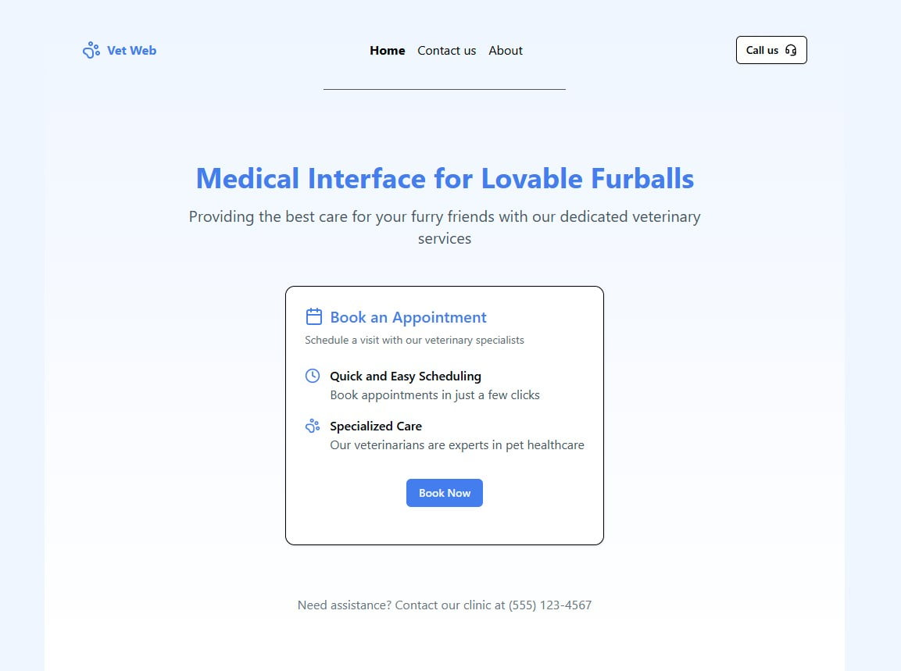

# Medical Interface for Lovable Furballs

> Medical webapp for veterinarians

- [Medical Interface for Lovable Furballs](#medical-interface-for-lovable-furballs)
  - [Goal](#goal)
  - [Demo](#demo)
  - [Tools](#tools)
  - [Todo](#todo)
  - [Structure](#structure)
  - [Thanks](#thanks)
  - [Page views](#page-views)

## Goal

The goal of this project is to provide veterinarians with a comprehensive web application to streamline the management of their practice. The platform will allow them to:

- **Manage patient records**: Store and update medical histories, treatments, and vaccination schedules.
- **Schedule and track appointments**: Set up consultations, send reminders, and prevent scheduling conflicts.
- **Facilitate communication**: Provide a secure messaging system for veterinarians to communicate with pet owners.
- **Generate reports and prescriptions**: Easily create and store medical documents.
- **Improve workflow efficiency**: Reduce paperwork and administrative overhead with an intuitive interface.

This webapp aims to enhance the daily operations of veterinary clinics, making patient care more efficient and organized.

## Demo

Online demo: [https://vet-web-app.netlify.app](https://vet-web-app.netlify.app/)

## Tools

- [XState visualizer & editor](https://stately.ai/registry/editor)

## Todo

- [ ] Compare Zustand with other state management libraries
- [ ] Performance monitoring (lighthouse)
- [ ] Enhance summary with labels instead of keys
- [ ] Handle CVL format
- [ ] Handle step metadata like : date: 'form.userDate => YYYY-MM-DD'
- [ ] Handle step metadata like : { section: 'Section B', title: '2. Dog Details', subtitle: 'fill in your dog details' }

## Structure

src/
├── components/            # UI Components (Atomic Design)
│   ├── atoms/             # Smallest reusable components (Button, Input, Label)
│   ├── molecules/         # Grouped atoms forming functional components
│   ├── organisms/         # Complex UI structures combining molecules
│
├── utils/                 # Business logic and utilities
│   ├── foobar.const.ts    # Foobar related constants
│   ├── foobar.store.ts    # Foobar related Zustand store
│   ├── foobar.utils.ts    # Foobar related utility functions
│   ├── foobar.types.ts    # Foobar related TypeScript types
│
├── pages/                 # Page components (LoginPage, DashboardPage)
│        ├── App.tsx       # Main app entry point
│
├── routes/                # TanStack app routing
│   ├── __root.tsx.tsx     # Root route
│   ├── index.tsx          # Home page
│   ├── about.tsx          # About page
│
├── .gitignore
├── package.json
├── README.md              # This file :p

## Thanks

- [Biome](https://biomejs.dev) : super fast linter & formatter
- [Boxy Svg](https://boxy-svg.com) : simple & effective svg editor
- [Esbuild](https://github.com/evanw/esbuild) : an extremely fast JavaScript bundler and minifier
- [Favicon](https://realfavicongenerator.net/) : the favicon generator
- [Github](https://github.com) : for all their great work year after year, pushing OSS forward
- [Knip](https://knip.dev/) : the code quality tool
- [Lucid icons](https://lucide.dev/icons/) : the icons
- [Oxc](https://oxc.rs) : a lovely super-fast collection of JavaScript tools written in Rust
- [React-app-structure](https://github.com/Shpendrr/react-app-structure) : the structure template
- [React](https://react.dev) : great library for web and native user interfaces
- [Shadcn/ui](https://ui.shadcn.com/) : the UI components
- [Shields.io](https://shields.io) : for the nice badges on top of this readme
- [Svg Omg](https://jakearchibald.github.io/svgomg/) : the great king of svg file size reduction
- [TailwindCss](https://tailwindcss.com) : awesome lib to produce maintainable style
- [V8](https://github.com/demurgos/v8-coverage) : simple & effective cli for code coverage
- [Vite](https://vitejs.dev/) : the bundler
- [Vitest](https://github.com/vitest-dev/vitest) : super fast vite-native testing framework
- [Zod](https://github.com/colinhacks/zod) : typeScript-first schema validation

## Page views

