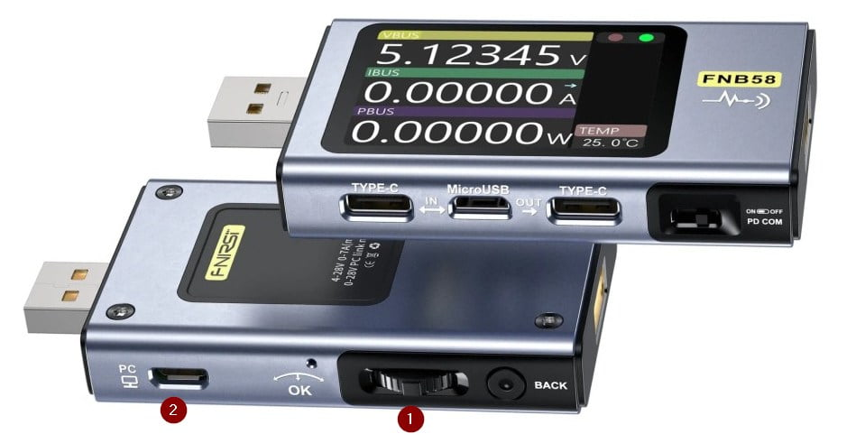

# FNIRSI FNB-58 USB Meter

## Upgrade procedure

1. Get latest tool and firmware for the `fnb58` from internet, on 2025-07 I used [this page](https://www.fnirsi.com/pages/manuals-firmwares)
2. Extract the downloaded zip files to their respective folders, e.g. `FNIRSI.Usb.Meter.upgrade.tool` and `FNIRSI.Usb.Meter.firmware`
3. Start the PC software : `FNIRSI.Usb.Meter.upgrade.tool/UsbMeter.exe`
4. Get a nice `USB A <--> Micro-USB` cable with data capabilities and connect it to your PC, I used the Lenovo tablet one
5. Press and maintain the fnb58 middle wheel click button `(1) in the image`
6. Connect the USB cable using the Micro-USB port on fnb58 device ,has as PC label and icon, `(2) in the image`
7. Release the middle wheel click button, your fnb58 device should now be in `bootloader mode`, the screen should display `FNB-58 DFU`
8. The fnb58 device should appears in the PC software
9. If it's the first time connection to PC wait at least one minute because Windows can try to install/detect and disconnect, if the connection is stable and nothing happens, perfect, proceed to next step
10. Go to `System` tab in the PC software
11. Check the actual firmware version called `Application version`
12. If you want to upgrade, click on the folder icon to open the firmware file, ex : `FNIRSI.Usb.Meter.firmware/Fnb58V0.68.ufn`
13. You should see the firmware correctly loaded in the PC software with this kind of logs : `[2025/07/17 - 09:53:16] Firmware name: Fnb58V0.68.ufn` `[2025/07/17 - 09:53:16] Firmware size: 367 KB`
14. Click on the `Upgrade` button which is a green rotating refresh icon -.-''
15. The PC software and fnb58 device should now display a progress bar
16. At the end PC software and fnb58 device restart automatically
17. Go to `System` tab in the PC software and check the new firmware version
