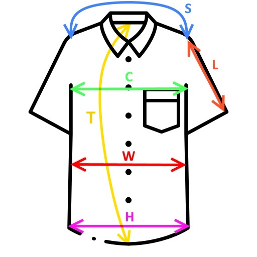
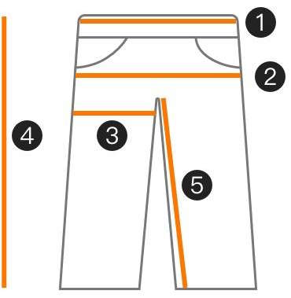

# Sizes & Measurements

- [Sizes \& Measurements](#sizes--measurements)
  - [Tops : Tee-shirts, shirts](#tops--tee-shirts-shirts)
  - [Pants](#pants)
  - [Belts](#belts)
  - [Body fat](#body-fat)
  - [Shoes](#shoes)
  - [Socks](#socks)
  - [Watches](#watches)

## Tops : Tee-shirts, shirts

Sizes : M to L for EU

| Marker | Trad          | Cm  | Inch | Feet |
| ------ | ------------- | --- | ---- | ---- |
| S      | Shoulders     | 44  |      |      |
| L      | Sleeve length | 66  |      |      |
| C      | Chest, Bust   | 100 |      |      |
| W      | Waist         | 90  |      |      |
| H      | Hips          | 95  |      |      |
| T      | Total Height  | 72  |      |      |
|        | Body Height   | 184 |      | 6    |

Even for a hoodie (AliExpress), M it fits perfectly marked with a chest width of 102 cm.

## Pants

| Marker | Trad                |  Cm   | Inch | Feet |
| ------ | ------------------- | :---: | ---- | ---- |
| 1      | Waist size          |  95   |      |      |
| 2      | Hip size            |  102  |      |      |
| 3      | Thigh length        |  30   |      |      |
| 4      | Total/bottom length |  102  |      |      |
| 5      | In-seam length      | 75/80 |      |      |

Sizes vary a lot from one brand to another but here are the sizes I currently wear:

- EU sizes: L, 42 to 46
- US sizes: W32 to W34, L32 to L34

The min/max are included, so my average size is 44 EU and W33 L33 US.

Waist & hips measurement: 90cm, 90/2 = size 45 EU normally but size 44 EU is better

Jean size: width 44cm +- 1 or 2 cm (my waist circumference), length 107cm +-3cm (of which 76cm legs)

Last time at Uniqlo I got several slim fit Chinos 34x32 inch (so 86.5 x 81.5 cm), 40€ each

## Belts

Size L

| Criteria            | Nope nope | Ok but not less | Ok or ideal | Ok but not much | Nope too much |
| ------------------- | :-------: | :-------------: | :---------: | :-------------: | :-----------: |
| Length (total)      |  108 cm   |     110 cm      | 112-117 cm  |     122 cm      |    124 cm     |
| Length (leather)    |  103 cm   |     105 cm      | 107-112 cm  |     116 cm      |    118 cm     |
| Width (leather)     |   23 mm   |      25 mm      |  27–37 mm   |      39 mm      |     41 mm     |
| Thickness (leather) |   1 mm    |      2 mm       |    3 mm     |      4 mm       |     5 mm      |

When I bought the Levi's one (24€ on Amz), the size mentioned was 110, which happened to be the total length of the belt (leather + buckle). The leather part alone was 105 cm.

When I bought the Tommy Hilfiger one (25€ on Amz), the size mentioned was 110, which corresponds to nothing, the total length was 130 cm and the leather part alone was 125 cm.

## Body fat

Waist measurement on 24/01/22 : 95 cm
Neck measurement on 24/01/22 : 37 cm
Height : 184 cm
86.010*log(95-37)-70.041*log(184)+30.30 = 23.34%

## Shoes

Heel to toe length: 28/29 cm

## Socks

39/42 EU is perfect in the end, 43+ is too big.

## Watches

17cm wrist circumference
