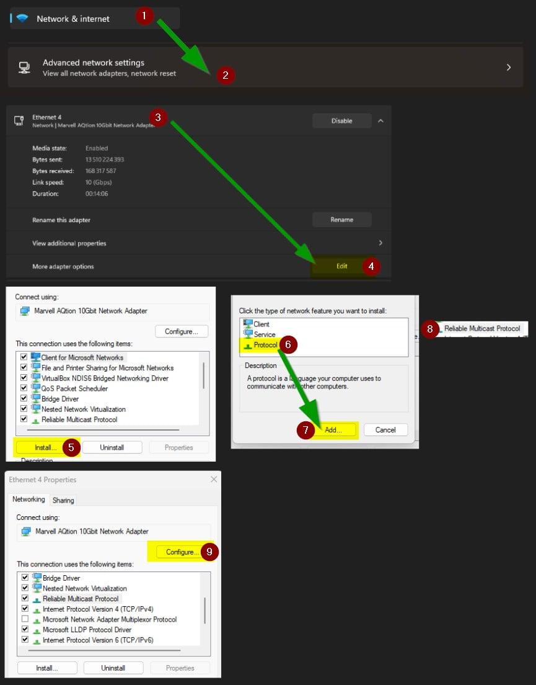

# TX401 V2

> 10 Gigabit PCI Express Network Adapter

## Fix the disconnect issue on heavy network transfers

Add the "Reliable Multicast Protocol" (steps 1 to 8) :

Then at step 9 set these specific options :

- Energy Efficient Ethernet: Off
- Flow Control: Off
- Interrupt Moderation: Disabled
- Interrupt Moderation Rate: Disabled
- Receive Side Scaling: Disabled

After all these changes, I managed to have a stable connection with heavy network transfers. But the [nPerf upload](https://www.nperf.com/fr/) was still able to disconnect the network adapter.
