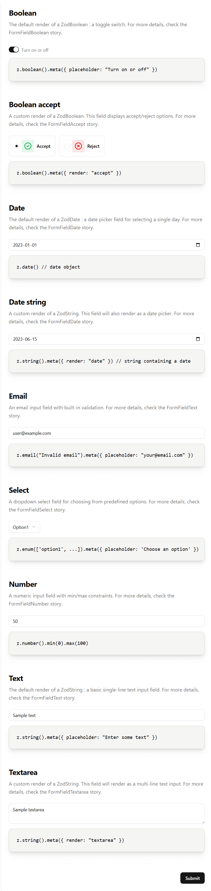

# AutoForm Component Documentation

Complete documentation for the AutoForm component system, which automatically generates multi-step forms from Zod schemas with validation, state management, and submission handling.

## Quick Start

### Installation & Import

```typescript
import { AutoForm } from '@monorepo/components'
import { z } from 'zod'

// Define your form schema
const schema = z.object({
  name: z.string().min(1).meta({
    label: 'Full Name',
    placeholder: 'John Doe',
  }),
  email: z.email().meta({
    label: 'Email Address',
    placeholder: 'john@example.com',
  }),
})

// Render the form
export function MyForm() {
  return (
    <AutoForm
      schemas={[schema]}
      onSubmit={async (data) => console.log(data)}
    />
  )
}
```

---

## Table of Contents

1. [Overview](#overview)
2. [Core API](#core-api)
3. [Field Metadata](#field-metadata)
4. [Field Types](#field-types)
5. [Multi-Step Forms](#multi-step-forms)
6. [Advanced Features](#advanced-features)
7. [Utilities & Helpers](#utilities--helpers)
8. [Architecture](#architecture)
9. [Examples](#examples)
10. [Testing & Development](#testing--development)
11. [Troubleshooting](#troubleshooting)

---

## Overview

**AutoForm** is a zero-configuration form generator that:

- **Generates UI automatically** from Zod schemas (no manual field components needed)
- **Routes to correct components** based on field type (text, number, boolean, select, file upload)
- **Manages state** across multiple steps with automatic validation
- **Handles data flow** with smart mapping for external data sources
- **Shows/hides fields** conditionally based on form state
- **Validates in real-time** with error display below fields
- **Supports file uploads** with progress tracking and extension validation
- **Displays summaries** before submission with confirmation
- **Manages submission states** (loading, success, error, warning)
- **Type-safe** with full TypeScript and Zod integration

### Architecture Overview

```text
┌────────────────────────────────────────────┐
│ AutoForm (Main Container)                  │
│ • State management (currentStep, formData) │
│ • Form orchestration                       │
│ • Navigation flow                          │
│                                            │
│  ┌──────────────────┬──────────────────┐   │
│  │  AutoFormStepper │  Content Area    │   │
│  │  (Left sidebar)  │  ┌────────────┐  │   │
│  │                  │  │ Fields     │  │   │
│  │  • Step 1        │  │ • Field 1  │  │   │
│  │  • Step 2        │  │ • Field 2  │  │   │
│  │  • Step 3        │  │ • Field 3  │  │   │
│  │                  │  └────────────┘  │   │
│  │  Icons:          │  ┌────────────┐  │   │
│  │  • 📝 Editable   │  │ Navigation │  │   │
│  │  • ✓  Success    │  │ Back | Next│  │   │
│  │  • 🔒 Readonly   │  └────────────┘  │   │
│  └──────────────────┴──────────────────┘   │
│                                            │
│  Optional Components:                      │
│  • Summary Step (review before submit)     │
│  • Submission Step (status display)        │
└────────────────────────────────────────────┘
```

---

## Core API

### AutoFormProps

```typescript
type AutoFormProps<Type extends z.ZodRawShape> = {
  // ===== REQUIRED =====
  schemas: z.ZodObject<Type>[]; // Array of Zod schemas (one per step)

  // ===== OPTIONAL CALLBACKS =====
  onSubmit?: (data: any) => any; // Called on final submission
  onChange?: (data: Record<string, unknown>) => void; // Called on any field change

  // ===== OPTIONAL DATA =====
  initialData?: Record<string, unknown>; // Pre-fill form with initial values

  // ===== OPTIONAL FEATURES =====
  useSummaryStep?: boolean; // Show summary before submit (default: false)
  useSubmissionStep?: boolean; // Show submission status (default: false)
  showCard?: boolean; // Wrap in card styling (default: true)
  logger?: Logger; // Logger for debugging

  // ===== OPTIONAL CUSTOMIZATION =====
  labels?: {
    homeButton?: string; // "Return to Homepage"
    lastStepButton?: string; // "Submit"
    nextStep?: string; // "Next"
    previousStep?: string; // "Back"
    summaryStepButton?: string; // "Proceed"
  };
};
```

### Basic Usage

```typescript
<AutoForm
  schemas={[schema1, schema2]}
  onSubmit={(data) => api.submit(data)}
  onChange={(data) => console.log(data)}
  initialData={{ name: 'John' }}
  useSummaryStep
  useSubmissionStep
/>
```

---

## Field Metadata

Every field in your Zod schema must include `.meta()` with field configuration:

```typescript
const schema = z.object({
  email: z.email().meta({
    label: "Email Address",
    placeholder: "your@email.com",
    state: "editable",
  }),
});
```

### Metadata Properties

```typescript
type AutoFormFieldMetadata = {
  // Display properties
  label?: string; // Field label above input
  placeholder?: string; // Placeholder or description text
  title?: string; // Section title (for section render)
  subtitle?: string; // Section subtitle (for section render)
  description?: string; // Section description or field help text
  code?: string; // Code block content (for section render)
  line?: boolean; // Show divider line (for section render)

  // Field rendering
  render?: "text" | "textarea" | "date" | "number" | "boolean" | "select" | "upload" | "accept" | "section"; // Component to render

  // Field state
  state?: "editable" | "readonly" | "disabled"; // User can interact?

  // Conditional logic
  dependsOn?: string; // Show only if this field has a value
  excluded?: boolean; // Don't include in submitted data

  // Multi-step forms
  step?: string; // Step name/title in stepper

  // Data transformation
  key?: string; // Maps both input & output keys
  keyIn?: string; // Map initial data from different key name
  keyOut?: string; // Map submitted data to different key name

  // Select/enum options
  options?: SelectOption[]; // Custom label/value pairs
};
```

### Metadata Examples

```typescript
// Text field
name: z.string().meta({
  label: 'Full Name',
  placeholder: 'John Doe',
}),

// Email with validation
email: z.email().meta({
  label: 'Email Address',
  placeholder: 'user@example.com',
}),

// Readonly field (user sees but can't edit)
userId: z.string().meta({
  label: 'User ID',
  state: 'readonly',
}),

// Disabled field (grayed out, can't interact)
status: z.string().meta({
  label: 'Status',
  state: 'disabled',
}),

// Optional field only shown if another field has a value
country: z.enum(['US', 'CA']).meta({
  label: 'Country',
}),
state: z.string().meta({
  label: 'State',
  dependsOn: 'country',  // Only visible if country is selected
}),

// Field excluded from submission
confirmPassword: z.string().meta({
  label: 'Confirm Password',
  excluded: true,  // Not sent to server
}),

// Select with custom labels
status: z.enum(['pending', 'approved']).meta({
  label: 'Application Status',
  options: [
    { label: 'Under Review', value: 'pending' },
    { label: 'Approved', value: 'approved' },
  ],
}),

// Data key mapping (for external APIs)
firstName: z.string().meta({
  label: 'First Name',
  keyIn: 'user.profile.firstName',   // Read from this path
  keyOut: 'user.profile.firstName',  // Write to this path
}),

// Boolean field with description
agreeTerms: z.boolean().meta({
  label: 'I agree to the terms',
  placeholder: 'Must be checked to continue',
}),

```

---

## Field Types

AutoForm automatically determines which component to render based on the Zod schema type.

**Available field types:**

- Text input (`z.string()`)
- Textarea (`z.string().meta({ render: 'textarea' })`)
- Password (`z.string().meta({ render: 'password' })`)
- Email (`z.email()`)
- Number (`z.number()`)
- Boolean/Checkbox (`z.boolean()`)
- Select/Dropdown (`z.enum()`)
- Date picker (`z.date()` or `z.string().meta({ render: 'date' })`)
- File upload (`z.instanceof(File)`)
- Accept/Reject buttons (`z.boolean().meta({ render: 'accept' })`)
- Informational sections (`z.string().meta({ render: 'section' })`)



### 1. Text Fields

**Zod Type:** `z.string()`
**Renders:** Text input with validation

```typescript
z.object({
  name: z.string().min(2, "At least 2 characters").meta({
    label: "Full Name",
    placeholder: "John Doe",
  }),
  url: z.string().url("Must be valid URL").meta({
    label: "Website",
    placeholder: "https://example.com",
  }),
  bio: z.string().max(500).meta({
    label: "Bio",
    placeholder: "Tell us about yourself",
  }),
});
```

**Features:**

- String validation from schema (min, max, email, url, regex)
- Readonly and disabled states
- Error messages display automatically

---

### 2. Textarea Fields

**Zod Type:** `z.string()` with `render: 'textarea'`
**Renders:** Multi-line text input

```typescript
z.object({
  description: z.string().min(10, "At least 10 characters").meta({
    label: "Description",
    placeholder: "Enter a detailed description",
    render: "textarea",
  }),
  feedback: z.string().optional().meta({
    label: "Additional Feedback",
    placeholder: "Optional comments",
    render: "textarea",
  }),
  terms: z.string().meta({
    label: "Terms & Conditions",
    render: "textarea",
    state: "readonly", // Display-only
  }),
});
```

**Features:**

- Multi-line text editing
- String validation from schema (min, max, required)
- Readonly and disabled states
- Auto-expanding height based on content
- Error messages display automatically

---

### 3. Password Fields

**Zod Type:** `z.string()` with `render: 'password'`
**Renders:** Password input (text masked)

```typescript
z.object({
  password: z.string().min(8, "Password must be at least 8 characters").meta({
    label: "Password",
    placeholder: "Enter your password",
    render: "password",
  }),
  newPassword: z.string().min(8).meta({
    label: "New Password",
    placeholder: "Set a new password",
    render: "password",
  }),
  confirmPassword: z.string().min(8).optional().meta({
    label: "Confirm Password",
    placeholder: "Repeat your password",
    render: "password",
  }),
});
```

**Features:**

- Masked text input (bullets/dots instead of visible characters)
- String validation from schema (min, max, required)
- Readonly and disabled states
- Ideal for secure password entry
- Error messages display automatically

---

### 4. Number Fields

**Zod Type:** `z.number()`
**Renders:** Number input with type coercion

```typescript
z.object({
  age: z.number().min(18).max(120).meta({
    label: "Age",
    placeholder: "25",
  }),
  salary: z.number().positive("Must be positive").meta({
    label: "Annual Salary",
    placeholder: "50000",
  }),
  quantity: z.number().int("Must be whole number").meta({
    label: "Quantity",
  }),
});
```

**Features:**

- Automatic string-to-number conversion
- Handles undefined for optional fields
- Number validation (min, max, positive, int)

---

### 5. Boolean Fields

**Zod Type:** `z.boolean()` or `z.literal(true/false)`
**Renders:** Checkbox/Toggle switch

```typescript
z.object({
  // Interactive checkbox
  agreeToTerms: z.boolean().meta({
    label: "I agree to the Terms & Conditions",
    placeholder: "You must accept",
  }),

  // Optional boolean
  newsletter: z.boolean().optional().meta({
    label: "Subscribe to newsletter",
    placeholder: "Receive weekly updates",
  }),

  // Display-only (always checked, disabled)
  systemAdmin: z.literal(true).meta({
    label: "System Administrator",
  }),
});
```

**Features:**

- Regular boolean for interactive checkboxes
- Boolean literals for display-only toggles
- Placeholder becomes checkbox description

---

### 6. Select Fields

**Zod Type:** `z.enum()` or `z.union()`
**Renders:** Dropdown select

```typescript
z.object({
  // Auto-capitalized labels from enum values
  country: z.enum(["us", "ca", "mx"]).meta({
    label: "Country",
    placeholder: "Select your country",
  }),

  // Custom labels for options
  status: z.enum(["pending", "approved", "rejected"]).meta({
    label: "Application Status",
    options: [
      { label: "Pending Review", value: "pending" },
      { label: "Approved", value: "approved" },
      { label: "Rejected", value: "rejected" },
    ],
  }),

  // Optional select
  department: z.enum(["sales", "engineering", "hr"]).optional().meta({
    label: "Department",
  }),
});
```

**Features:**

- Auto-capitalization of enum values
- Custom label/value pairs via `options`
- Readonly and disabled states
- Placeholder support

---

### 7. Date Fields

**Zod Type:** `z.date()` or `z.string()` with `render: 'date'`
**Renders:** Date picker

```typescript
z.object({
  // Native Date field
  birthDate: z.date().meta({
    label: "Date of Birth",
    placeholder: "Select your birth date",
  }),

  // String as date (useful for APIs that expect ISO string)
  eventDate: z.string().meta({
    label: "Event Date",
    placeholder: "Select event date",
    render: "date",
  }),

  // Optional date field
  reminderDate: z.date().optional().meta({
    label: "Reminder Date",
  }),
});
```

**Features:**

- Interactive date picker
- Date validation from schema
- Converts between Date objects and string representations
- Readonly and disabled states

---

### 8. File Upload Fields

**Zod Type:** `z.instanceof(File)` with validation
**Renders:** File input with progress

```typescript
import { fileSchema } from "@monorepo/components";

z.object({
  // Document with extension validation
  resume: fileSchema(["pdf", "doc", "docx"]).meta({
    label: "Resume",
    placeholder: "PDF or Word document",
  }),

  // Image with multiple formats
  avatar: fileSchema(["jpg", "png", "gif"]).meta({
    label: "Profile Picture",
  }),

  // Archive file
  portfolio: fileSchema(["zip", "rar"]).meta({
    label: "Portfolio",
  }),
});
```

**Features:**

- Extension validation (e.g., only PDF/DOC)
- File size display
- Upload progress bar with percentage
- States: Idle → Uploading → Success/Error
- Action buttons: Cancel, Retry, Remove
- Integrated with form validation

---

### 9. Accept/Reject Fields

**Zod Type:** `z.boolean()` with `render: 'accept'`
**Renders:** Accept/Reject button pair

```typescript
z.object({
  // Accept/Reject decision
  approve: z.boolean().optional().meta({
    label: "Do you approve this request?",
    render: "accept",
  }),

  // In sections for clarity
  confirmDelete: z.boolean().meta({
    label: "Confirm deletion",
    description: "This action cannot be undone",
    render: "accept",
  }),
});
```

**Features:**

- Two-button interface (Accept/Reject)
- Explicit user confirmation
- Better UX for critical decisions
- Returns true (accept) or false (reject)
- Optional support for non-required decisions

---

### 10. Section Fields

**Zod Type:** `z.string()` with `render: 'section'`
**Renders:** Informational content (non-interactive)

```typescript
z.object({
  section1Title: z.string().meta({
    title: "Account Settings",
    description: "Manage your account information",
    render: "section",
  }),

  email: z.email().meta({
    label: "Email Address",
  }),

  section2Title: z.string().meta({
    title: "Security",
    description: "Update your password and two-factor authentication",
    render: "section",
  }),

  password: z.string().min(8).meta({
    label: "New Password",
  }),

  codeDisplay: z.string().meta({
    code: 'z.email().meta({ label: "Email" })',
    line: true,
    render: "section",
  }),
});
```

**Features:**

- Display titles, descriptions, and code examples
- Non-interactive (not submitted)
- Useful for visual organization
- Can display code blocks with syntax highlighting
- Optional divider lines between sections
- Automatically excluded from form data

**Section Metadata:**

```typescript
type FormFieldSectionProps = {
  title?: string; // Section heading
  subtitle?: string; // Secondary heading
  description?: string; // Descriptive text
  code?: string; // Code block to display
  line?: boolean; // Show separator line
};
```

---

## Multi-Step Forms

Use an array of schemas to create multi-step forms with automatic navigation:

```typescript
// Step 1: Personal Information
const step1Schema = z.object({
  firstName: z.string().meta({
    label: 'First Name',
  }),
  lastName: z.string().meta({
    label: 'Last Name',
  }),
}).meta({
  title: '1. Personal Information',  // Step title on schema object
  subtitle: 'Basic personal details',  // Optional subtitle
})

// Step 2: Contact Details
const step2Schema = z.object({
  email: z.email().meta({
    label: 'Email Address',
  }),
  phone: z.string().meta({
    label: 'Phone Number',
  }),
}).meta({
  title: '2. Contact Details',  // Step title on schema object
  subtitle: 'How we can reach you',  // Optional subtitle
})

// Step 3: Confirmation
const step3Schema = z.object({
  agreeToTerms: z.boolean().meta({
    label: 'I agree to Terms & Conditions',
  }),
}).meta({
  title: '3. Confirmation',  // Step title on schema object
  subtitle: 'Review and accept terms',  // Optional subtitle
})

<AutoForm
  schemas={[step1Schema, step2Schema, step3Schema]}
  onSubmit={handleSubmit}
/>
```

**Step Navigation:**

- Back button to previous step
- Next button to advance (enabled only when current step is valid)
- Submit button on final step
- Step icons show state: 📝 editing, ✓ completed, 🔒 readonly

---

## Advanced Features

### 1. Conditional Field Visibility

Show fields only when another field has a value:

```typescript
const schema = z.object({
  hasShippingAddress: z.boolean().meta({
    label: "Different shipping address?",
  }),

  // These only appear when hasShippingAddress is true
  shippingStreet: z.string().meta({
    label: "Street Address",
    dependsOn: "hasShippingAddress",
  }),
  shippingCity: z.string().meta({
    label: "City",
    dependsOn: "hasShippingAddress",
  }),
  shippingZip: z.string().meta({
    label: "ZIP Code",
    dependsOn: "hasShippingAddress",
  }),
});
```

**How it works:**

- Fields with `dependsOn` are hidden until that field has a truthy value
- Hidden fields are excluded from validation and submission
- Works with checkboxes, selects, text inputs

**Field Value Comparison Syntax:**

Show fields only when another field has a specific value:

```typescript
const schema = z.object({
  petType: z.enum(["dog", "cat"]).meta({
    label: "Pet Type",
  }),

  // Only visible when petType === 'dog'
  exerciseRoutine: z.string().meta({
    label: "Exercise Routine",
    dependsOn: "petType=dog",
  }),

  // Only visible when petType === 'cat'
  indoorSpace: z.string().meta({
    label: "Indoor Space",
    dependsOn: "petType=cat",
  }),

  // Visible when ownsParent is truthy (boolean or non-empty value)
  parentName: z.string().meta({
    label: "Parent Name",
    dependsOn: "ownsParent",
  }),
});
```

**Syntax Options:**

- `dependsOn: 'fieldName'` - Shows field when fieldName is truthy
- `dependsOn: 'fieldName=value'` - Shows field when fieldName equals the exact string value

Examples:

- `dependsOn: 'knowsParent'` → hidden if knowsParent is false, empty, null, or undefined
- `dependsOn: 'breed=dog'` → hidden unless breed field value equals "dog"
- `dependsOn: 'breed=cat'` → hidden unless breed field value equals "cat"

---

### 2. Data Key Mapping

Map between form field names and external data structures (APIs, databases):

```typescript
// API returns nested data structure
const apiData = {
  user: {
    profile: {
      firstName: 'John',
      lastName: 'Doe',
    },
    contact: {
      email: 'john@example.com',
      phone: '555-1234',
    }
  }
}

// Form schema with key mappings
const schema = z.object({
  firstName: z.string().meta({
    label: 'First Name',
    keyIn: 'user.profile.firstName',   // Read from this path
    keyOut: 'user.profile.firstName',  // Write to this path
  }),
  lastName: z.string().meta({
    label: 'Last Name',
    keyIn: 'user.profile.lastName',
    keyOut: 'user.profile.lastName',
  }),
  email: z.string().meta({
    label: 'Email',
    keyIn: 'user.contact.email',
    keyOut: 'user.contact.email',
  }),
})

// Use initialData to pass API data
<AutoForm
  schemas={[schema]}
  initialData={apiData}
  onSubmit={(data) => api.updateUser(data)}
/>
```

**Key mapping options:**

- `key='fieldName'` - Maps both input and output to same key
- `keyIn='source.path'` - Maps initial data from different path
- `keyOut='dest.path'` - Maps submitted data to different path
- Supports nested paths with dot notation (e.g., 'user.profile.name')

---

### 3. Excluded Fields

Some fields shouldn't be submitted (e.g., confirmation fields):

```typescript
const schema = z.object({
  password: z.string().meta({
    label: "Password",
  }),
  confirmPassword: z.string().meta({
    label: "Confirm Password",
    excluded: true, // Not included in submitted data
  }),
});

// Validation still happens, but confirmPassword won't be sent to server
```

---

### 4. Summary Step

Show data review before submission:

```typescript
<AutoForm
  schemas={[schema]}
  onSubmit={handleSubmit}
  useSummaryStep={true}
/>
```

**Flow:**

1. User fills all steps
2. Click submit on final step
3. Summary page appears showing all form data in table format
4. User reviews and clicks "Proceed" to confirm
5. Form submits to onSubmit callback

---

### 5. Submission Status

Show loading, success, error, or warning states:

```typescript
const onSubmit = async (data) => {
  try {
    const response = await api.submit(data)
    return {
      submission: {
        status: 'success',
        children: <p>Form submitted successfully!</p>,
        detailsList: [
          'Confirmation sent to your email',
          'Your reference ID: #12345'
        ],
        tooltipDetailsList: [
          'Keep this ID for future inquiries'
        ]
      }
    }
  } catch (error) {
    return {
      submission: {
        status: 'error',
        children: <p>Submission failed</p>,
        detailsList: [error.message],
      }
    }
  }
}

<AutoForm
  schemas={[schema]}
  onSubmit={onSubmit}
  useSubmissionStep={true}
/>
```

**Status values:**

- `'loading'` - Show spinner while processing
- `'success'` - Show success message with details
- `'warning'` - Show warning with details (submitted anyway)
- `'error'` - Show error with retry button
- `'unknown-error'` - Generic error with retry option

---

### 6. Field States

Control how users interact with fields:

```typescript
const schema = z.object({
  // Normal interactive field
  email: z.email().meta({
    label: "Email",
    state: "editable", // (default)
  }),

  // User can see but not modify
  userId: z.string().meta({
    label: "User ID",
    state: "readonly", // Value visible, can't change
  }),

  // Grayed out, cannot interact
  status: z.string().meta({
    label: "Status",
    state: "disabled", // Grayed out, locked
  }),
});
```

**States:**

- `'editable'` - User can freely modify (default)
- `'readonly'` - Value visible but cannot be changed
- `'disabled'` - Grayed out, fully locked

---

## Utilities & Helpers

### File Upload Helpers

#### fileSchema()

Create Zod schema for file uploads with extension validation:

```typescript
import { fileSchema } from '@monorepo/components'

// Allow specific extensions
const schema = z.object({
  resume: fileSchema(['pdf', 'doc', 'docx']).meta({
    label: 'Resume',
  }),
})

// In tests with shouldFail prop
<FormFieldUpload
  {...props}
  shouldFail={true}  // Simulate upload failure
/>
```

#### formatFileSize()

Human-readable file size formatting:

```typescript
formatFileSize(512); // "512 B"
formatFileSize(1024); // "1 KB"
formatFileSize(1024 * 1024); // "1 MB"
formatFileSize(1024 ** 3); // "1 GB"
```

---

### Schema Analysis Utilities

#### getZodEnumOptions()

Extract options from Zod enum schema:

```typescript
const schema = z.enum(["pending", "approved", "rejected"]);
const result = getZodEnumOptions(schema);

if (result.ok) {
  // result.value = [
  //   { label: 'Pending', value: 'pending' },
  //   { label: 'Approved', value: 'approved' },
  //   { label: 'Rejected', value: 'rejected' }
  // ]
}
```

#### Type Checking Functions

```typescript
// Check if schema is a specific type (handles optional wrapper)
isZodEnum(fieldSchema); // true if z.enum() or z.optional(z.enum())
isZodBoolean(fieldSchema); // true if z.boolean() or z.literal(bool)
checkZodBoolean(fieldSchema); // Returns { isBoolean, isBooleanLiteral, booleanLiteralValue }
isZodNumber(fieldSchema); // true if z.number()
isZodDate(fieldSchema); // true if z.date() or z.optional(z.date())
isZodString(fieldSchema); // true if z.string()
isZodFile(fieldSchema); // true if z.instanceof(File)
```

#### Form Field Analysis Utilities

```typescript
// Get the render type for a field (auto-detection + explicit)
getFormFieldRender(fieldSchema); // Returns: 'text' | 'textarea' | 'date' | 'number' | 'boolean' | 'select' | 'upload' | undefined

// Get metadata from field schema
getFieldMetadata(fieldSchema); // Returns: AutoFormFieldMetadata | undefined

// Get metadata from step schema
getStepMetadata(stepSchema); // Returns: AutoFormStepMetadata | undefined

// Parse dependsOn syntax
parseDependsOn(dependsOn); // Returns: { fieldName: string; expectedValue?: string }
```

---

### Data Transformation Utilities

#### filterSchema()

Get schema with only visible fields based on current form state:

```typescript
const filtered = filterSchema(schema, formData);
// Returns new schema excluding hidden fields
// Useful for validation: filtered.safeParse(formData).success
```

#### mapExternalDataToFormFields()

Transform incoming data using keyIn mappings:

```typescript
const apiData = { user: { givenName: "John" } };
const mapped = mapExternalDataToFormFields(schema, apiData);
// Maps 'user.givenName' → 'firstName' (if keyIn: 'user.givenName')
```

#### normalizeDataForSchema()

Remove hidden, excluded, and section fields before submission:

```typescript
const normalized = normalizeDataForSchema(schema, formData);
// - Removes fields with unmet dependencies
// - Removes fields with excluded: true
// - Removes fields with render: 'section'
// - Applies keyOut mappings to nested paths
```

#### normalizeData()

Apply normalization across multiple schemas:

```typescript
const cleaned = normalizeData(schemas, formData);
// Applies normalizeDataForSchema() to all schemas in sequence
```

#### mockSubmit()

Helper for testing/demos with simulated submission:

```typescript
const result = await mockSubmit('success', <p>Saved!</p>)
// Returns: { submission: { status: 'success', ... } }
```

---

## Architecture

### File Structure

```text
molecules/
├── auto-form.tsx                      # Main component
├── auto-form.types.ts                 # Type definitions
├── auto-form.utils.tsx                # Schema utilities
├── auto-form.md                       # This documentation
│
├── auto-form-field.tsx                # Field router (picks component)
├── form-field.tsx                     # Base field wrapper
├── form-field-text.tsx                # Text input
├── form-field-textarea.tsx            # Textarea input
├── form-field-number.tsx              # Number input
├── form-field-boolean.tsx             # Checkbox/Toggle
├── form-field-select.tsx              # Dropdown select
├── form-field-date.tsx                # Date picker
├── form-field-accept.tsx              # Accept/Reject buttons
├── form-field-section.tsx             # Informational sections
├── form-field-upload.tsx              # File upload
├── form-field-upload.const.ts         # Upload constants
│
├── auto-form-stepper.tsx              # Step navigation
├── auto-form-fields.tsx               # Fields for current step
├── auto-form-navigation.tsx           # Back/Next/Submit buttons
├── auto-form-summary-step.tsx         # Review page
├── auto-form-submission-step.tsx      # Status display
├── form-summary.tsx                   # Summary table
│
├── auto-form.stories.tsx              # Comprehensive examples
├── auto-form-fields.stories.tsx       # All field types showcase
├── form-field-*.stories.tsx           # Individual field stories
├── auto-form.utils.test.ts            # Utility tests
├── form-field-upload.test.ts          # Upload tests
└── form-summary.test.tsx              # Summary tests
```

### Data Flow

```text
User Input (keyboard, mouse, file)
           ↓
    Form Field Component
           ↓
   React Hook Form (validation)
           ↓
     useWatch hook
           ↓
  formData state update
           ↓
  onChange callback (if provided)
           ↓
    filterSchema (re-evaluate visibility)
           ↓
      Re-render UI
```

### State Management

**AutoForm State:**

- `currentStep` (number) - Current step index
- `formData` (object) - All data across all steps
- `showSummary` (boolean) - Whether summary is showing
- `submissionProps` (object) - Submission status

**React Hook Form State:**

- Field values and changes
- Validation state per field
- Touched/dirty fields
- Field-level errors

---

## Render Type Auto-Detection

When you don't explicitly set `render` in metadata, AutoForm automatically selects the right component:

```typescript
// Automatic detection based on Zod schema type
z.string()              → render: 'text'
z.string().email()      → render: 'text' (validated as email)
z.number()              → render: 'number'
z.boolean()             → render: 'boolean'
z.date()                → render: 'date'
z.enum(['a', 'b'])      → render: 'select'
z.instanceof(File)      → render: 'upload'

// Override with explicit render in metadata
z.string().meta({ render: 'textarea' })      // Multi-line instead of single
z.string().meta({ render: 'date' })          // Date picker (stores ISO string)
```

**When to use explicit `render`:**

- `render: 'textarea'` - For long text descriptions
- `render: 'date'` - For z.string() fields that represent dates (APIs expecting ISO strings)
- `render: 'accept'` - For boolean fields with accept/reject semantics
- `render: 'section'` - For informational content (headers, descriptions, code examples)

---

## Examples

### Example 1: Simple Contact Form

```typescript
import { AutoForm } from '@monorepo/components'
import { z } from 'zod'

const schema = z.object({
  name: z.string().min(1, 'Name required').meta({
    label: 'Your Name',
    placeholder: 'John Doe',
  }),
  email: z.email('Invalid email').meta({
    label: 'Email Address',
    placeholder: 'john@example.com',
  }),
  message: z.string().min(10, 'At least 10 characters').meta({
    label: 'Message',
    placeholder: 'Tell us your message',
  }),
})

export function ContactForm() {
  return (
    <AutoForm
      schemas={[schema]}
      onSubmit={async (data) => {
        await fetch('/api/contact', { method: 'POST', body: JSON.stringify(data) })
      }}
    />
  )
}
```

---

### Example 2: Multi-Step Checkout

```typescript
const shippingSchema = z.object({
  email: z.email().meta({
    label: 'Email',
    title: 'Shipping',
  }),
  fullName: z.string().meta({
    label: 'Full Name',
    title: 'Shipping',
  }),
  address: z.string().meta({
    label: 'Address',
    title: 'Shipping',
  }),
  city: z.string().meta({
    label: 'City',
    title: 'Shipping',
  }),
  postalCode: z.string().meta({
    label: 'Postal Code',
    title: 'Shipping',
  }),
})

const billingSchema = z.object({
  sameAsShipping: z.boolean().meta({
    label: 'Same as shipping address',
    title: 'Billing',
  }),
  billingAddress: z.string().meta({
    label: 'Billing Address',
    dependsOn: 'sameAsShipping',
    title: 'Billing',
  }),
})

const paymentSchema = z.object({
  cardNumber: z.string().regex(/^\d{16}$/).meta({
    label: 'Card Number',
    title: 'Payment',
  }),
  expiry: z.string().regex(/^\d{2}\/\d{2}$/).meta({
    label: 'MM/YY',
    title: 'Payment',
  }),
  cvv: z.string().regex(/^\d{3}$/).meta({
    label: 'CVV',
    title: 'Payment',
  }),
})

export function CheckoutForm() {
  return (
    <AutoForm
      schemas={[shippingSchema, billingSchema, paymentSchema]}
      useSummaryStep
      useSubmissionStep
      onSubmit={async (data) => api.processOrder(data)}
    />
  )
}
```

---

### Example 3: Job Application with File Upload

```typescript
import { fileSchema } from '@monorepo/components'

const applicationSchema = z.object({
  fullName: z.string().meta({
    label: 'Full Name',
    title: 'Personal Info',
  }),
  email: z.email().meta({
    label: 'Email',
    title: 'Personal Info',
  }),
  phone: z.string().meta({
    label: 'Phone',
    title: 'Personal Info',
  }),

  resume: fileSchema(['pdf', 'doc', 'docx']).meta({
    label: 'Resume',
    title: 'Documents',
  }),
  coverLetter: fileSchema(['pdf', 'doc', 'docx']).optional().meta({
    label: 'Cover Letter (Optional)',
    title: 'Documents',
  }),

  agreeToTerms: z.boolean().meta({
    label: 'I agree to the privacy policy',
    title: 'Confirmation',
  }),
})

export function JobApplicationForm() {
  return (
    <AutoForm
      schemas={[applicationSchema]}
      useSummaryStep
      useSubmissionStep
      onSubmit={async (data) => {
        const formData = new FormData()
        formData.append('fullName', data.fullName)
        formData.append('email', data.email)
        formData.append('resume', data.resume)
        if (data.coverLetter) formData.append('coverLetter', data.coverLetter)

        return api.submitApplication(formData)
      }}
    />
  )
}
```

---

### Example 4: Form with Conditional Fields

```typescript
const registrationSchema = z.object({
  accountType: z.enum(["individual", "business"]).meta({
    label: "Account Type",
    options: [
      { label: "Personal Account", value: "individual" },
      { label: "Business Account", value: "business" },
    ],
  }),

  firstName: z.string().meta({
    label: "First Name",
    dependsOn: "accountType",
  }),
  lastName: z.string().meta({
    label: "Last Name",
    dependsOn: "accountType",
  }),

  // Only shown when accountType = 'business'
  companyName: z.string().meta({
    label: "Company Name",
    dependsOn: "accountType",
  }),
  taxId: z.string().meta({
    label: "Tax ID",
    dependsOn: "accountType",
  }),
});
```

---

## Testing & Development

### Running Commands

```bash
# Check TypeScript errors
nx ts-check components

# Run unit tests
nx test components

# Run with watch mode
nx test components --watch

# Run Storybook E2E tests
nx run components:test-storybook

# Run linter
pnpm check:oxlint

# Run all checks (required before commit)
pnpm run check
```

### Writing Tests

```typescript
import { render, screen } from '@testing-library/react'
import userEvent from '@testing-library/user-event'

describe('AutoForm', () => {
  it('should submit form when valid', async () => {
    const onSubmit = vi.fn()
    render(
      <AutoForm schemas={[schema]} onSubmit={onSubmit} />
    )

    const emailInput = screen.getByTestId('email')
    await userEvent.type(emailInput, 'test@example.com')

    const submitBtn = screen.getByRole('button', { name: 'Submit' })
    await userEvent.click(submitBtn)

    expect(onSubmit).toHaveBeenCalledWith(
      expect.objectContaining({ email: 'test@example.com' })
    )
  })
})
```

### Storybook Development

View and test components interactively:

```bash
# Start Storybook dev server
pnpm run storybook:run

# Then navigate to http://localhost:6006
```

View `auto-form.stories.tsx` for comprehensive examples.

---

## Troubleshooting

### Fields not rendering

**Problem:** No fields appear in form
**Solution:** Check that all fields have `.meta()` with at least `label`

```typescript
// ❌ Wrong - no metadata
const schema = z.object({
  email: z.email(),
});

// ✅ Correct - has metadata
const schema = z.object({
  email: z.email().meta({
    label: "Email Address",
  }),
});
```

### Validation not working

**Problem:** Form submits even with invalid data
**Solution:** Ensure all schema validations are applied

```typescript
// ❌ Wrong - no validation
z.string();

// ✅ Correct - has validation
z.string().min(1, "Required").email("Invalid email");
```

### Conditional fields not hiding

**Problem:** Fields with `dependsOn` still visible
**Solution:** Check that dependency value is actually empty when testing

```typescript
// Dependency checking:
// • Empty string: hidden ❌
// • "value": visible ✓
// • false: hidden ❌
// • true: visible ✓
// • undefined/null: hidden ❌
```

### File upload not accepting files

**Problem:** File input disabled or rejecting files
**Solution:** Use `fileSchema()` with proper extensions

```typescript
// ❌ Wrong - allows any file
z.instanceof(File);

// ✅ Correct - validates extensions
fileSchema(["pdf", "doc", "docx"]);
```

### Data not mapping correctly

**Problem:** Initial data not loading, or submitted data has wrong structure
**Solution:** Check `keyIn`/`keyOut` paths match actual data structure

```typescript
// API data: { user: { profile: { firstName: 'John' } } }
// Wrong:
keyIn: "firstName";

// Correct:
keyIn: "user.profile.firstName";
keyOut: "user.profile.firstName";
```

---

## Development Commands

```bash
# Validate TypeScript (required before commit)
nx ts-check components

# Run unit tests (required before commit)
nx test components

# Run Storybook E2E tests (required before commit)
nx run components:test-storybook --skip-nx-cache

# Fix linting issues
pnpm run lint

# Run all quality checks (required before commit)
pnpm run check
```

---

## Additional Resources

- [Zod Documentation](https://zod.dev) - Schema validation library
- [React Hook Form](https://react-hook-form.com) - Form state management
- [Shadcn/ui Atoms](../atoms) - Base components used by AutoForm
- Storybook Stories: `auto-form.stories.tsx` - Live examples and E2E tests
